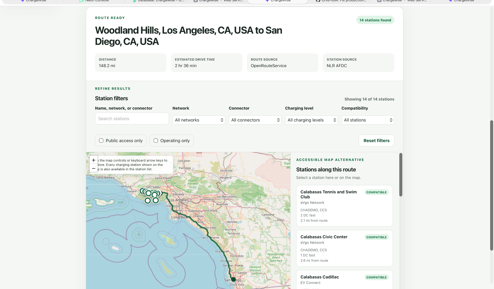
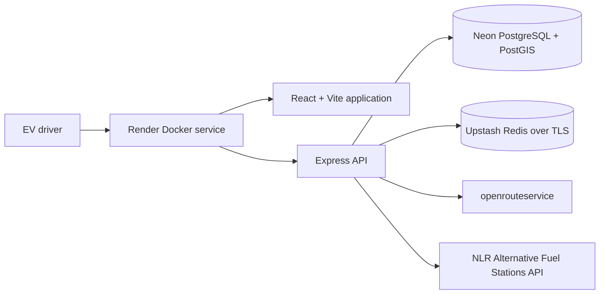
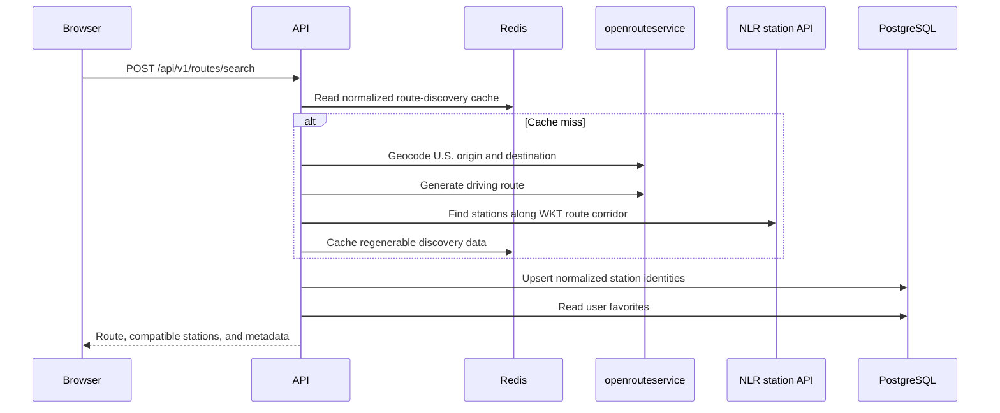

# ChargeWise

**ChargeWise** is a production-deployed full-stack EV route-planning and charging-analytics platform. Drivers can save an electric vehicle, find compatible public charging stations along a U.S. route, favorite useful stations, record real charging sessions, and review personal cost, energy, wait-time, charging-speed, and reliability trends.

[Live application](https://chargewise.onrender.com) · [Architecture](docs/02-architecture.md) · [Production deployment](docs/11-production-deployment.md) · [Two-minute walkthrough](docs/12-portfolio-walkthrough.md)

> The free Render service can sleep after inactivity, so the first request may take about a minute.



## What ChargeWise does

1. Registers and authenticates users with server-side sessions.
2. Stores user-owned EV profiles and connector compatibility.
3. Geocodes a U.S. origin and destination and generates a driving route.
4. Finds public charging stations within a selected route corridor.
5. Normalizes external station data before exposing it to the browser.
6. Displays a synchronized route map and accessible station list.
7. Saves favorite stations across visits.
8. Records charging sessions with cost, energy, duration, wait time, state of charge, and issues.
9. Calculates personal charging analytics by date range, network, station, and recent activity.

## Product motivation

Public charging information is fragmented. A station locator can show that a charger exists, but it usually cannot answer personal questions such as:

- Is this station compatible with my vehicle?
- How far is it from my route?
- Have I charged here before?
- What did charging cost?
- How long did I wait?
- What charging speed did I actually observe?
- Which networks and stations have been most dependable for me?

ChargeWise combines route-based public station discovery with user-owned charging history. It does not claim to provide real-time stall occupancy or guaranteed charger availability.

## Architecture

ChargeWise is deployed as one same-origin Docker web service. Express serves the compiled React application and the `/api/v1` API, which avoids cross-origin complexity in production.



### Route-search request flow



The cache stores only safely regenerable route-discovery data. Vehicle compatibility, request filters, persisted station IDs, favorites, and charging sessions are applied outside the shared cache.

## Engineering highlights

### Authentication and authorization

- Argon2id password hashing
- Opaque server-side sessions stored in Redis
- HttpOnly, Secure, SameSite cookies in production
- Session rotation and replay protection
- Origin validation, CORS restrictions, and endpoint rate limits
- User ownership included in reads and writes for vehicles, favorites, and sessions

### External provider boundaries

- Geocoding, routing, and station APIs sit behind provider interfaces
- Runtime responses are validated and normalized before entering application logic
- Timeouts and known provider errors become safe application errors
- Provider credentials remain server-side
- Production geocoding is restricted to U.S. results

### Data and analytics

- PostgreSQL stores users, vehicles, normalized stations, favorites, and charging sessions
- PostGIS stores station coordinates and supports geospatial indexing
- Drizzle owns schema, migrations, and database access
- Analytics calculate energy, spending, cost per kWh, observed charging power, wait time, issue-free percentage, network breakdowns, and recent activity

### Reliability and security

- Zod contracts are shared across the browser and API
- Structured request logging and request IDs
- Redis and PostgreSQL readiness checks
- Startup migrations before the production server becomes healthy
- Helmet security headers and a production Content Security Policy
- Tracked-secret scanning and production dependency auditing
- Accessible labels, keyboard navigation, focus states, skip link, and reduced-motion support

## Technology stack

| Layer              | Technology                                               |
| ------------------ | -------------------------------------------------------- |
| Web                | React 19, TypeScript, Vite, React Router, TanStack Query |
| Maps               | Leaflet, React Leaflet, OpenStreetMap tiles              |
| API                | Node.js, Express 5, TypeScript, Zod                      |
| Database           | PostgreSQL, PostGIS, Drizzle ORM                         |
| Sessions and cache | Redis                                                    |
| Providers          | openrouteservice, NLR Alternative Fuel Stations API      |
| Testing            | Vitest, React Testing Library, Supertest, Playwright     |
| Tooling            | pnpm workspaces, ESLint, Prettier, Docker Compose        |
| Production         | Docker, Render, Neon, Upstash, GitHub Actions            |

## Verification

The current local suite after the production usability release includes:

| Test layer                   |     Result |
| ---------------------------- | ---------: |
| Database integration tests   |   7 passed |
| API test suite               | 290 passed |
| Web test suite               |  50 passed |
| Playwright critical journeys |   3 passed |

The repository also runs formatting, linting, type checking, schema validation, tracked-secret scanning, production builds, and a production dependency audit.

### Performance measurement

A controlled local benchmark exercised the real HTTP API, PostgreSQL persistence, Redis infrastructure, route-search service, and response serialization with deterministic fixture providers:

| Path                  | Samples |       p50 |       p95 |
| --------------------- | ------: | --------: | --------: |
| Uncached route search |      30 | 10.776 ms | 12.252 ms |
| Cached route search   |      30 |  9.823 ms | 11.994 ms |

These are machine-specific fixture measurements, not claims about live provider or production latency. See [the full methodology and limitations](docs/10-performance-measurement.md).

## Production deployment

The public application runs at [chargewise.onrender.com](https://chargewise.onrender.com).

- Render builds and runs the Docker image.
- Neon provides pooled runtime PostgreSQL and a direct migration connection.
- Upstash provides TLS Redis for sessions, rate limits, and route-search cache entries.
- The container runs committed database migrations before starting Express.
- Render considers the service ready only after PostgreSQL and Redis pass `/api/v1/health`.

See [Production deployment](docs/11-production-deployment.md) for release, smoke-test, rollback, and recovery details.

## Local development

### Prerequisites

- Node.js 22.22.0 or newer
- pnpm 11
- Docker with Docker Compose
- openrouteservice and NLR API credentials

### Setup

```bash
git clone https://github.com/ErfanSadri/chargewise.git
cd chargewise

pnpm install
cp .env.example .env

docker compose up -d postgres redis
pnpm --filter @chargewise/database db:migrate
pnpm dev
```

The web application runs at `http://localhost:5173`, and the API runs at `http://localhost:3000`.

For database integration tests, create the disposable test database once:

```bash
docker compose exec postgres createdb -U chargewise chargewise_test
```

Never point `TEST_DATABASE_URL` at development or production data.

### Required local environment values

| Variable                   | Purpose                               |
| -------------------------- | ------------------------------------- |
| `DATABASE_URL`             | Local PostgreSQL connection           |
| `TEST_DATABASE_URL`        | Disposable `chargewise_test` database |
| `REDIS_URL`                | Local Redis connection                |
| `SESSION_SECRET`           | At least 32 characters                |
| `OPENROUTESERVICE_API_KEY` | Server-side geocoding and routing     |
| `NLR_API_KEY`              | Server-side U.S. station data         |
| `WEB_ORIGIN`               | Allowed browser origin                |

See [`.env.example`](.env.example) for the complete development configuration.

## Useful commands

```bash
pnpm dev                         # Run web and API development servers
pnpm check                       # Secrets, formatting, lint, types, schema, tests, builds
pnpm e2e                         # Run the three Playwright journeys
pnpm security:check              # Secret scan and production dependency audit
pnpm performance:route-search   # Run controlled route-search benchmark
pnpm deployment:smoke           # Verify a deployed instance
```

## Repository structure

```text
chargewise/
├── apps/
│   ├── api/                 # Express server, services, providers, repositories
│   └── web/                 # React application
├── packages/
│   ├── database/            # Drizzle schema, migrations, database integration tests
│   ├── shared/              # Shared Zod contracts and API-facing types
│   └── config/              # Workspace configuration package
├── e2e/                     # Playwright critical journeys
├── docs/                    # Product, architecture, security, performance, deployment
├── scripts/                 # Secret, deployment, and operational scripts
├── spikes/providers/        # Early external-provider validation
├── Dockerfile
├── compose.yaml
└── render.yaml
```

## Known limitations

- The free Render instance can have a noticeable cold start after inactivity.
- Provider quotas, rate limits, or outages can temporarily prevent route search.
- Station source status is not real-time stall occupancy.
- ChargeWise does not guarantee charger availability, route range, or arrival state of charge.
- Vehicle specifications are user-entered rather than sourced from a vehicle catalog.
- Public OpenStreetMap tiles are appropriate for this limited portfolio demo; larger traffic would require a reviewed tile provider.

## Project documentation

- [Product requirements](docs/01-product-requirements.md)
- [Architecture](docs/02-architecture.md)
- [Data model](docs/03-data-model.md)
- [API contract](docs/04-api-contract.md)
- [Delivery backlog](docs/05-delivery-backlog.md)
- [Security and accessibility review](docs/08-security-accessibility-review.md)
- [Playwright critical journeys](docs/09-playwright-critical-journeys.md)
- [Performance measurement](docs/10-performance-measurement.md)
- [Production deployment](docs/11-production-deployment.md)
- [Portfolio walkthrough](docs/12-portfolio-walkthrough.md)
- [Full-stack TypeScript decision](docs/decisions/ADR-001-full-stack-typescript.md)
- [Production hosting decision](docs/decisions/ADR-002-production-hosting.md)

## Author

Built by **Erfan Sadri** as a production-style full-stack engineering project centered on a real EV public-charging workflow.
