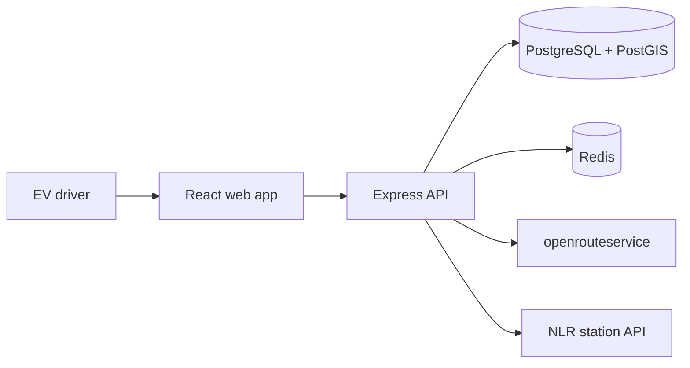
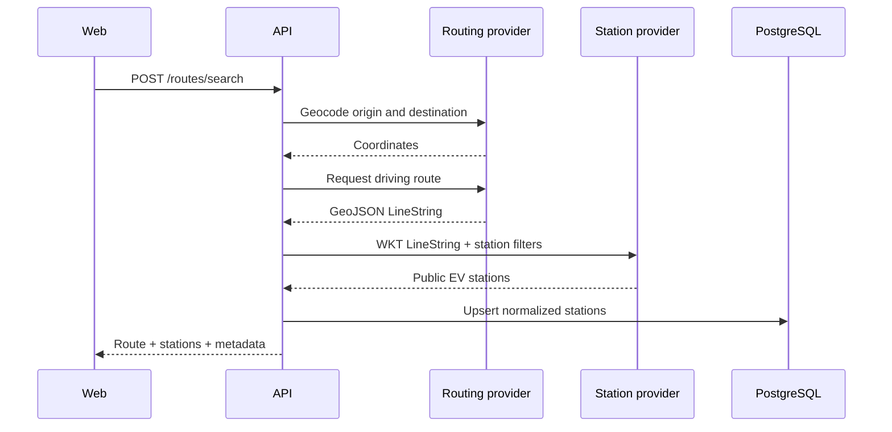
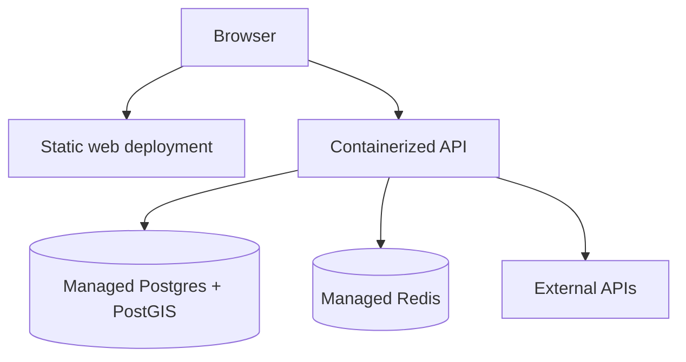

# ChargeWise v1 Architecture

**Status:** Phase 0 source of truth  
**Last updated:** 2026-08-02

## 1. Architectural goals

- Keep business rules independent from Express and React.
- Keep third-party API behavior behind provider interfaces.
- Share validation contracts without coupling the browser to database models.
- Protect API keys and authenticated resources on the server.
- Make core logic testable without network access.
- Remain deployable as a small portfolio application without unnecessary
  distributed-system complexity.

## 2. System context



The browser talks only to the ChargeWise API. The API owns authentication,
authorization, validation, provider credentials, normalization, persistence,
and analytics.

## 3. Monorepo boundaries

```text
chargewise/
├── apps/
│   ├── web/                 # React application
│   ├── api/                 # Express HTTP application
│   └── worker/              # P1 scheduled/background work
├── packages/
│   ├── shared/              # API DTOs, Zod schemas, enums
│   ├── database/            # Drizzle schema, migrations, repositories
│   └── config/              # Shared TypeScript/lint configuration
├── docs/
├── tests/
├── docker-compose.yml
└── pnpm-workspace.yaml
```

Rules:

- `web` may import API-facing types and schemas from `shared`.
- `web` may not import database schemas or server secrets.
- `api` coordinates controllers, services, providers, and repositories.
- `database` owns persistence implementation, not HTTP behavior.
- `shared` contains transport contracts, not confidential configuration.
- `worker` is not created until a confirmed P1 background use case exists.

## 4. Backend layers

```text
HTTP request
  -> route and middleware
  -> controller
  -> application service
  -> repository/provider
  -> database or external API
```

### Routes and middleware

Responsibilities:

- Match HTTP method and path.
- Load the authenticated user.
- Apply rate limits and request-size limits.
- Validate path, query, and body inputs with Zod.
- Forward a typed input to the controller.

Routes do not contain business logic.

### Controllers

Responsibilities:

- Translate HTTP input into an application-service call.
- Choose the appropriate HTTP status.
- Return the standard response envelope.

Controllers do not query the database or call external providers directly.

### Application services

Responsibilities:

- Enforce user ownership and business rules.
- Coordinate multiple repositories/providers.
- Define transaction boundaries.
- Return domain results independent of Express.

### Repositories

Responsibilities:

- Perform database reads and writes.
- Hide Drizzle/PostgreSQL details from services.
- Accept explicit user IDs for user-owned operations.

### External providers

Responsibilities:

- Call one external service.
- Enforce timeouts.
- Translate provider-specific data to an internal normalized model.
- Convert upstream failures into known application errors.

Proposed interfaces:

```ts
interface GeocodingProvider {
  geocode(query: string): Promise<GeocodedLocation[]>;
}

interface RoutingProvider {
  createRoute(input: RouteProviderInput): Promise<NormalizedRoute>;
}

interface StationProvider {
  findAlongRoute(input: StationCorridorQuery): Promise<NormalizedStation[]>;
}
```

## 5. Route-search data flow



Important details:

- GeoJSON coordinates are `[longitude, latitude]`, not `[latitude, longitude]`.
- The route converter must reject malformed coordinates before producing WKT.
- Provider responses are parsed with schemas; TypeScript types alone do not
  validate runtime JSON.
- The station provider call uses only public, existing EV stations for v1.
- The API returns a normalized contract, not the NLR raw response.

## 6. Authentication and authorization

### Authentication choice

- Email/password registration.
- Argon2id password hashing.
- Opaque server-side session identifier in an HttpOnly cookie.
- Session records stored in Redis.
- Secure cookies in production and SameSite protection.

### Authorization rule

Knowing a resource UUID is never sufficient authorization. Every query for a
user-owned resource includes the authenticated `user_id` or performs an
equivalent ownership check.

Example:

```text
unsafe:  SELECT * FROM charging_sessions WHERE id = :id
safe:    SELECT * FROM charging_sessions
         WHERE id = :id AND user_id = :authenticated_user_id
```

### CSRF/origin protection

- SameSite cookies reduce cross-site submission risk.
- State-changing requests validate allowed origins in production.
- CORS permits only the configured web origin.
- Authentication endpoints receive stricter rate limits.

## 7. Persistence and geospatial design

- PostgreSQL stores relational and analytical data.
- PostGIS stores station positions as `geography(Point, 4326)`.
- A GiST index supports distance-based queries in meters.
- The NLR source station ID is unique and supports idempotent upserts.
- Raw provider JSON may be stored in JSONB for debugging, but application code
  uses normalized columns.
- Redis stores server sessions and short-lived provider-query caches.
- Redis is never the source of truth for user records.

## 8. Cache policy

Cache only data that can be safely regenerated:

- geocoding results for normalized address queries;
- generated routes for normalized origin/destination/profile inputs;
- external station search results for route/filter combinations.

Initial TTLs are configuration values, not hard-coded business constants. They
will be selected after inspecting provider update behavior and documented in an
architecture decision. User charging sessions and favorites are not cached in
v1 unless measurements demonstrate a need.

## 9. Error model

Known error categories:

- `VALIDATION_ERROR` — invalid client input;
- `UNAUTHENTICATED` — no valid session;
- `FORBIDDEN` — authenticated but not allowed;
- `NOT_FOUND` — resource does not exist for the user;
- `CONFLICT` — duplicate email/favorite or invalid state transition;
- `PROVIDER_UNAVAILABLE` — upstream timeout or failure;
- `RATE_LIMITED` — request limit exceeded;
- `INTERNAL_ERROR` — unexpected server failure.

Production responses never expose stack traces, database errors, API keys, or
raw upstream bodies. Logs include a request ID so failures can be correlated.

## 10. Testing architecture

- Unit tests target pure calculations, converters, validation, and services.
- Provider contract tests parse saved representative fixtures.
- API integration tests run against a test PostgreSQL instance and mocked
  providers.
- React tests verify visible behavior rather than internal component state.
- Playwright tests exercise the three critical product journeys.
- Network-dependent tests are not part of the normal CI suite.

## 11. Production topology



Provider selection is deferred until the deployment milestone, but these
requirements are fixed:

- containerized Node runtime;
- managed PostgreSQL with PostGIS support;
- managed Redis with TLS;
- separate secrets for development, CI, and production;
- health endpoint and structured application logs;
- database migrations executed as an explicit release step.

## 12. Architecture guardrails

- No microservices in v1.
- No message queue until a real background requirement is implemented.
- No GraphQL; the product's resource-oriented API is sufficiently modeled by
  REST.
- No direct browser calls to authenticated third-party APIs.
- No `any` without a documented boundary and validation.
- No business calculations embedded in React components.
- No silent fallback to fabricated station data in production.
