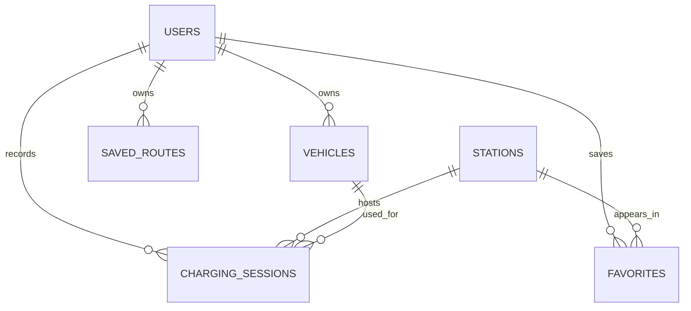

# ChargeWise v1 Data Model

**Status:** Phase 0 logical design  
**Last updated:** 2026-08-02

## 1. Modeling rules

- Primary keys are UUIDs generated server-side.
- All timestamps are stored in UTC as timezone-aware values.
- API values use explicit units in their names, such as `energy_added_kwh` and
  `charging_minutes`.
- User-owned tables contain `user_id` directly when doing so makes ownership
  enforcement safer and simpler.
- Database constraints protect critical invariants in addition to API
  validation.
- Monetary values use fixed-precision decimal storage, not floating point.

## 2. Entity relationships



## 3. `users`

| Column          | Type         | Constraint/purpose                             |
| --------------- | ------------ | ---------------------------------------------- |
| `id`            | UUID         | Primary key                                    |
| `email`         | VARCHAR(320) | Required, case-insensitive unique behavior     |
| `password_hash` | TEXT         | Required Argon2id hash; never returned by APIs |
| `created_at`    | TIMESTAMPTZ  | Required, default current time                 |
| `updated_at`    | TIMESTAMPTZ  | Required, updated on mutation                  |

Implementation note: normalize email for lookup and enforce uniqueness through
a lowercased value or a case-insensitive PostgreSQL type. The exact approach is
chosen in the database implementation lesson.

## 4. `vehicles`

| Column                  | Type         | Constraint/purpose                          |
| ----------------------- | ------------ | ------------------------------------------- |
| `id`                    | UUID         | Primary key                                 |
| `user_id`               | UUID         | Required FK to `users`, cascade delete      |
| `nickname`              | VARCHAR(80)  | Required                                    |
| `make`                  | VARCHAR(80)  | Required                                    |
| `model`                 | VARCHAR(120) | Required                                    |
| `year`                  | SMALLINT     | Required, reasonable year check             |
| `battery_capacity_kwh`  | NUMERIC(6,2) | Optional, positive                          |
| `efficiency_mi_per_kwh` | NUMERIC(5,2) | Optional, positive                          |
| `connector_types`       | TEXT[]       | Required, at least one supported enum value |
| `preferred_networks`    | TEXT[]       | Required, defaults to empty array           |
| `is_default`            | BOOLEAN      | Required, default false                     |
| `created_at`            | TIMESTAMPTZ  | Required                                    |
| `updated_at`            | TIMESTAMPTZ  | Required                                    |

Only one vehicle per user may be the default. This is enforced with a partial
unique index on `user_id WHERE is_default = true`.

Initial connector enum values:

- `CCS`
- `NACS`
- `J1772`
- `CHADEMO`

Provider connector codes will be normalized and tested rather than trusted to
match UI labels automatically. For example, a provider-specific J1772 Combo
code maps to the internal `CCS` value.

## 5. `stations`

| Column               | Type                  | Constraint/purpose                  |
| -------------------- | --------------------- | ----------------------------------- |
| `id`                 | UUID                  | Internal primary key                |
| `source`             | VARCHAR(30)           | Required; initially `NLR_AFDC`      |
| `source_station_id`  | VARCHAR(80)           | Required source identifier          |
| `name`               | VARCHAR(200)          | Required                            |
| `network`            | VARCHAR(120)          | Optional normalized network         |
| `street_address`     | VARCHAR(200)          | Optional                            |
| `city`               | VARCHAR(120)          | Optional                            |
| `state`              | VARCHAR(40)           | Optional                            |
| `postal_code`        | VARCHAR(20)           | Optional                            |
| `location`           | GEOGRAPHY(Point,4326) | Required longitude/latitude point   |
| `access_code`        | VARCHAR(40)           | Optional source access code         |
| `status_code`        | VARCHAR(40)           | Optional source operating status    |
| `level_2_port_count` | INTEGER               | Nonnegative, default 0              |
| `dc_fast_port_count` | INTEGER               | Nonnegative, default 0              |
| `connector_codes`    | TEXT[]                | Required, default empty array       |
| `raw_source_data`    | JSONB                 | Optional diagnostic/source snapshot |
| `source_updated_at`  | TIMESTAMPTZ           | Optional timestamp from source      |
| `last_synced_at`     | TIMESTAMPTZ           | Required ingestion timestamp        |

Indexes and constraints:

- Unique (`source`, `source_station_id`).
- GiST index on `location`.
- Index on normalized `network` for filtering.
- Nonnegative port-count checks.

The application will upsert a station using the source identity. Repeating the
same route search updates the existing station instead of creating duplicates.

## 6. `favorites`

| Column       | Type        | Constraint/purpose               |
| ------------ | ----------- | -------------------------------- |
| `user_id`    | UUID        | FK to `users`, cascade delete    |
| `station_id` | UUID        | FK to `stations`, cascade delete |
| `created_at` | TIMESTAMPTZ | Required                         |

Primary key: (`user_id`, `station_id`). This makes a duplicate favorite
impossible at the database level.

## 7. `charging_sessions`

| Column             | Type          | Constraint/purpose                             |
| ------------------ | ------------- | ---------------------------------------------- |
| `id`               | UUID          | Primary key                                    |
| `user_id`          | UUID          | Required FK to `users`, cascade delete         |
| `vehicle_id`       | UUID          | Required FK to `vehicles`                      |
| `station_id`       | UUID          | Required FK to `stations`                      |
| `started_at`       | TIMESTAMPTZ   | Required                                       |
| `charging_minutes` | INTEGER       | Required, greater than 0                       |
| `wait_minutes`     | INTEGER       | Required, at least 0                           |
| `energy_added_kwh` | NUMERIC(7,3)  | Required, greater than 0                       |
| `total_cost`       | NUMERIC(10,2) | Required, at least 0                           |
| `starting_soc`     | SMALLINT      | Required, 0 through 99                         |
| `ending_soc`       | SMALLINT      | Required, 1 through 100 and greater than start |
| `odometer_miles`   | INTEGER       | Optional, nonnegative                          |
| `issue_type`       | ENUM          | Required, default `NONE`                       |
| `notes`            | VARCHAR(1000) | Optional                                       |
| `created_at`       | TIMESTAMPTZ   | Required                                       |
| `updated_at`       | TIMESTAMPTZ   | Required                                       |

`issue_type` values:

- `NONE`
- `UNAVAILABLE`
- `BROKEN`
- `SLOW`
- `PAYMENT`
- `OCCUPIED`
- `OTHER`

Important ownership invariant: the selected vehicle must belong to the same
user as the charging session. This requires an application-service check; a
simple foreign key cannot enforce it by itself without a more complex composite
key design.

## 8. `saved_routes` (P1)

| Column              | Type                      | Constraint/purpose                     |
| ------------------- | ------------------------- | -------------------------------------- |
| `id`                | UUID                      | Primary key                            |
| `user_id`           | UUID                      | Required FK to `users`, cascade delete |
| `name`              | VARCHAR(120)              | Required                               |
| `origin_label`      | VARCHAR(240)              | Required                               |
| `destination_label` | VARCHAR(240)              | Required                               |
| `origin_point`      | GEOGRAPHY(Point,4326)     | Required                               |
| `destination_point` | GEOGRAPHY(Point,4326)     | Required                               |
| `route_geometry`    | GEOMETRY(LineString,4326) | Required                               |
| `distance_meters`   | INTEGER                   | Required, positive                     |
| `duration_seconds`  | INTEGER                   | Required, positive                     |
| `created_at`        | TIMESTAMPTZ               | Required                               |

## 9. Derived analytics

Analytics are computed from charging sessions in v1 instead of stored as
duplicated totals.

```text
total_energy_kwh = SUM(energy_added_kwh)
total_cost       = SUM(total_cost)
average_cost_kwh = total_cost / total_energy_kwh
average_power_kw = SUM(energy_added_kwh) /
                   (SUM(charging_minutes) / 60)
average_wait     = AVG(wait_minutes)
issue_free_rate  = COUNT(issue_type = NONE) / COUNT(all sessions)
```

The API returns `null`, not a misleading zero, when a ratio cannot be computed
because there are no qualifying sessions.

## 10. Deletion behavior

- Deleting a user deletes their vehicles, favorites, and charging sessions.
- Deleting a vehicle is rejected if charging sessions reference it in v1; the
  user must delete/reassign those sessions first.
- Stations are not deleted when a favorite or session is deleted.
- Station cleanup, if ever needed, must preserve stations referenced by user
  history.
