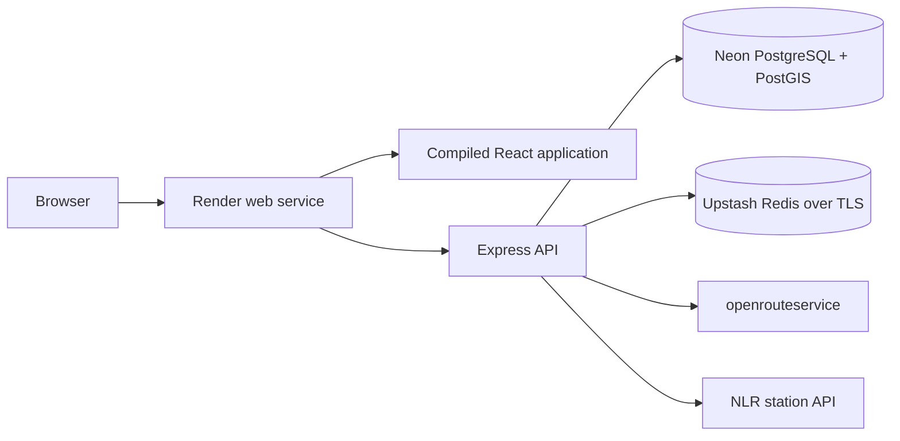

# Production deployment

Ticket: CHG-063

## Topology

ChargeWise is deployed as one same-origin Docker web service:



Express serves the Vite production files after all `/api/v1` routers. Direct
navigation to a browser route returns `index.html`, while unknown API routes
continue to return the standard JSON error envelope.

## Production resources

Create the managed resources before creating the Render Blueprint:

1. Create a Neon project in the same general region as the Render service.
2. Enable PostGIS if it is not already available.
3. Copy both Neon connection strings:
   - pooled connection for `DATABASE_URL`;
   - direct connection for `MIGRATION_DATABASE_URL`.
4. Create an Upstash Redis database and copy its TLS `rediss://` connection
   string.
5. Confirm active openrouteservice and NLR credentials.

Do not commit any of these values.

## Render Blueprint

The repository-root `render.yaml` defines the Docker service, readiness path,
pre-deploy migration, and non-secret production settings.

In Render:

1. choose **New > Blueprint**;
2. connect the ChargeWise GitHub repository;
3. select `render.yaml`;
4. provide each environment value marked `sync: false`;
5. create the service and inspect the first build and migration logs.

Required secret values:

| Variable                   | Value                       |
| -------------------------- | --------------------------- |
| `DATABASE_URL`             | Neon pooled PostgreSQL URL  |
| `MIGRATION_DATABASE_URL`   | Neon direct PostgreSQL URL  |
| `REDIS_URL`                | Upstash TLS `rediss://` URL |
| `OPENROUTESERVICE_API_KEY` | server-side provider key    |
| `NLR_API_KEY`              | server-side provider key    |

Render generates `SESSION_SECRET`. It also supplies `PORT` and
`RENDER_EXTERNAL_URL`; ChargeWise uses those values when the local aliases are
not present.

## Release behavior

The image build:

1. installs the locked pnpm workspace;
2. builds shared, database, API, and web packages;
3. creates a production-only API deployment with its workspace dependencies;
4. copies the compiled Vite application into `/app/web`;
5. runs as the non-root `node` user.

Before a new image receives traffic, Render runs:

```text
node dist/deployment/migrate.js
```

The migration runner prefers `MIGRATION_DATABASE_URL`, falls back to
`DATABASE_URL`, applies the packaged Drizzle migrations, closes the connection,
and exits nonzero without printing credentials when migration fails.

Render then probes:

```text
GET /api/v1/health
```

The endpoint returns `200` only when PostgreSQL and Redis both respond. A `503`
prevents the instance from being considered ready.

## Automated production smoke check

After the deployment is live:

```text
DEPLOYMENT_URL=https://YOUR-SERVICE.onrender.com pnpm deployment:smoke
```

The script waits through a possible free-instance cold start, then verifies:

- PostgreSQL and Redis readiness;
- the root application shell;
- direct navigation to `/login`;
- preservation of the JSON API 404 contract;
- the map-tile Content Security Policy allowance.

## P0 production checklist

Complete these manually against the public HTTPS URL:

1. register a fresh account and confirm refresh restores the session;
2. create, edit, make default, and delete a vehicle;
3. run a real U.S. route search using live providers;
4. confirm the route, real station list, map, filters, and station details;
5. favorite and unfavorite a station, including after refresh;
6. create, edit, and delete a charging session;
7. confirm history and analytics update after each change;
8. verify sign-out and protected-route redirection;
9. test keyboard navigation, visible focus, mobile layout, and browser zoom;
10. inspect Render logs for request IDs and safe structured messages.

Do not claim that all P0 criteria pass until this checklist has been completed
against the deployed service.

## Rollback and recovery

- A failed pre-deploy migration stops the release before the new image goes
  live. Correct the configuration or migration and redeploy.
- A failed readiness check keeps unhealthy instances out of traffic. Inspect the
  structured logs and managed-service status pages.
- Render can roll back to a recent successful deploy, but database migrations
  are forward-only. A schema rollback requires a reviewed compensating
  migration.
- Rotate a provider, database, Redis, or session credential immediately if it is
  exposed. Do not paste secret values into issues, logs, screenshots, or Git.

## Known limitations

- Render's free web service can sleep after inactivity, so the first request can
  take substantially longer than warm requests.
- Local fixture performance results do not represent live provider or deployed
  latency.
- OpenStreetMap public tiles are suitable for this limited portfolio demo;
  higher traffic requires reviewing the tile usage policy and selecting an
  appropriate tile provider.
- Managed-service quotas and upstream provider availability can temporarily
  prevent route search even when the application itself is healthy.
